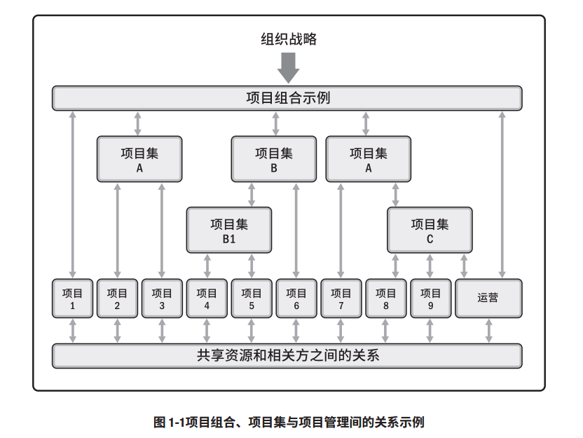
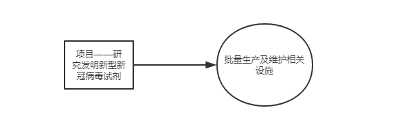
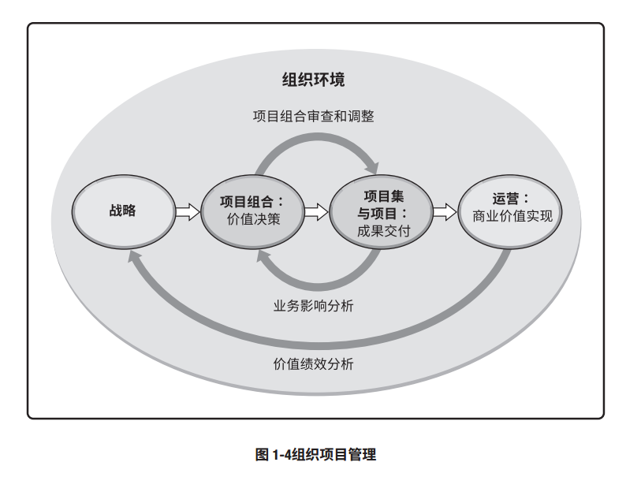

# IT项目管理课程——个人作业一

本文总阅读量次

## 前言

本次实验是本学期IT项目管理课程的第一次作业，是理解描述与本课程有关的一些概念的一次作业。

## 1、内容与要求

  - 内容

    - 讨论 **projects、 programs、和 portfolio** 之间的**关系**以及对企业成功的**贡献**；以及与**operations**以及**OPM**之间的关系。

  - 要求

    - 请先阅读《PMBok6》 中文版，第一部分的 1.2.3 节；第二部分 1.2
节；

    - 必须描述projects、 programs、 portfolio 、 operations 和 OPM 的概念；

    - 必须用图或表格表达它们之间的关系与区别，使得读者更容易理解；

    - 必须列举合适案例用以区别这些概念

    - 请在自己博客或 Github 等电子媒体发布自己的作业， 不能使用 doc或 pdf 格式。

    - 作业提交， TA 会通过调查之星等工具收集每次作业 URL

## 2、完成过程

  - 首先已阅读相关内容。

  - 描述projects、 programs、 portfolio 、 operations 和 OPM 的概念：

    - **projects**：项目，指的是为创造独特的产品、服务或成果而进行的临时性工作。

      - **独特的产品、服务或成果**（a unique purpose），指的是它不是一个常规的操作（a routine operation），是为实现一个特定目标而设计的一组特定的操作。
      
      - **临时性**（temporary），指的是项目有明确的起点和终点。同时，项目虽是临时性工作，但其可交付成果可能会在项目的终止后依然存在。

      - 它通过**可交付成果**达成**目标**

      - 项目需要随着发展而逐步细化（progressive elaboration）

      - 项目通常需要来自不同领域的资源（resources）

      - 项目应该有一位主要客户或发起人（customer or sponsor）

      - 项目充满不确定性（involves uncertainty）

    - **programs**：项目集(课件PPT翻译成计划)

      - 项目集，指的是**相互关联**且被**协调管理**的项目、子项目集和项目集活动(以便获得分别管理所无法获得的利益)。

    - **portfolio**：项目组合(课件PPT翻译成投资组合)

      - 项目组合，指的是为**实现战略目标而组合在一起管理**的项目、项目集、子项目组合和运营工作。

    - **operations**：运营(管理)

      - 运营(管理)，指的是其关注产品的持续生产和服务的持续运作。(它使用最优资源满足客户要求，来保证业务运作的持续高效)

    - **OPM**：组织级项目管理 

      - 组织级项目管理，指的是**开展项目组合管理、项目集管理和项目管理的战略执行框架**。(该框架使组织**不断地**以**可预见**的方式取得**更好的绩效**、**更好的结果**及**可持续的竞争优势**，从而实现<u>**组织战略**</u>。)
  
  - 表达它们之间的关系与区别：

    - projects 与 programs 与 portfolio：

      - 使用原书上的图来加以区分：

        

        可以看出项目组合与项目集之间、项目组合和项目之间以及项目集与单个项目之间都**存在联系**，但这些联系<u>**并不总是存在严格的等级层次**</u>，具体如下表格：

        |  | 项目 | 项目集 | 项目组合 |
        |:------:|:------:|:------:|:------:|
        | 定义 | 创造独特的产品、服务或成果而进行的临时性工作 | 相互关联且被协调管理的项目、子项目集和项目集活动 | 为实现战略目标而组合在一起管理的项目、项目集、子项目组合和运营工作 |
        | 范围 | 项目具有明确的目标，具有渐进明细特点(在整个生命周期中) | 包括项目集组件的范围(保证组件输出和成果协调互补)| 随组织战略目标变化而变化 |
        | 管理 | 项目经理为实现项目目标而管理项目团队 | 由项目经理管理，通过协调项目集组件的活动来确保项目集效益按预期实现 | 项目组合经理可管理或协调项目组合管理人员或对总体项目组合负有报告指责的项目集和项目人员 |
        | 规划 | 项目经理在整个项目生命周期中，逐步将宏观信息细化成详细的计划 | 项目经理在整个项目生命周期中，逐步将宏观信息细化成详细的计划 | 项目经理在整个项目生命周期中，逐步将宏观信息细化成详细的计划 |
        | 变更方式 | 通过作出预期而进行变更(项目经理) | 随项目集各交付的组件成果和输出的改变而改变 | 项目组合经理应持续监督更广泛内外部环境的变更 |
        | 监督 | 项目经理监督生产工作 | 项目经理监控进度计划 | 项目组合经理监督战略资源分配 |
        | 成功 | 项目质量、时间表、预算的依从性、客户满意度进行评估 | 通过项目集向组织交付预期效益的能力以及项目集交付所述效益的效率和效果进行衡量评估 | 总体投资效果和实现的效益进行衡量评估 |

      - 举例：

        - 

    - **项目(项目集、项目组合)(管理)** 与 **运营(管理)** 的关系

      - **共性**

        - 业务或组织运营的改变也许就是某个项目的关注焦点，尤其当项目**交付的新产品或新服务**将导致业务运营的有**实质性改变**时。持续运营不属于项目的范畴，但是它们之间存在交叉，即在其生命周期中有如下交叉：
        
          - 在新产品开发、产品升级或提高产量时

          - 在改进运营或产品开发流程时

          - 在产品生命周期结束阶段

          - 在每个收尾阶段

        - 都受制于有限的资源

        - 都是为业务或组织的经营需要与战略目标服务的

      - **差异(前者 VS 后者)**

        - 临时性与持久性

        - 独特性和重复相同性质

        - 逐渐细化特点和标准化特点

      - 其他：两者可以在某些节点进行转换，如**共性**中所述。

      - 使用表格简单描述：

        |  | 项目 | 运营 |
        |:------:|:------:|:------:|
        | 持续时间 | 临时性 – 有明确的开始和结束时间（尽管可能变更） | 持续或可重复的活动 |
        | 目标 | 交付服务/产品比较明确的关闭项目条件 | 支持业务 |
        | 结果 | 创建唯一的产品或服务 | 支持业务 |

      - **实例**：

        - 

    - **项目(项目集、项目组合)(管理)** 与 **OPM组织级项目管理** 的关系

      - 项目组合、项目集和项目均需要符合组织战略，或由组织战略驱动，并以不同的方式服务于战略目标的实现。

      - 它旨在确保组织开展正确的项目并合适地分配关键资源。 OPM 有助于确保组织的各个层级都了解组织的战略愿景、支持愿景的举措、目标以及可交付成果。

      - 套用原书上的图进行图形化解释：

        

## 3、总结

  - 本次作业是该课程的第一次作业，是对相关基本概念进行学习理解的一次作业。