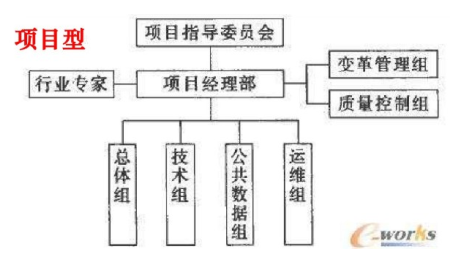

# IT项目管理课程——个人作业二

本文总阅读量次

## 前言

本次作业是本学期IT项目管理课程的第二次作业。

## i)、内容与要求

  - 内容

    - 请使用系统方法分析问题，大约600-800字（选择一题）。

      1. 使用业务、组织、技术三维模型系统管理方法分析某校园项目（可自定义）的可行性；

      2. 有人说企业信息化是“一把手工程”。通过网络搜索IT项目缺乏高级管理层支持失败案例，运用思维导图或系统模型描述高级管理层支持的重要性；
      
      3. 选CMMI、 ASPICE、 ITIL、 COBIT5或其他任一IT行业标准，围绕1-2张结构或原理图，解释它运用系统化思维决解行业问题方法；

  - 要求

    - 请在自己博客或 Github 等电子媒体发布自己的作业， 不能使用 doc或 pdf 格式。

    - 作业提交， TA 会通过调查之星等工具收集每次作业 URL

## ii)、完成过程 --> 我选择题1——使用业务、组织、技术三维模型系统管理方法分析某校园项目（可自定义）的可行性。

  1. 项目简介

   - 本自定义项目是参考Summer校园进行自定义制定的，它是一款大学生校园答题社交APP，为用户提供了精华主题讨论、个人动态分享等功能。
   
   - 校园时代青涩纯真的爱情和友情，是值得每一个同学去怀念的。它创新性的采用考试答题的趣味交友的方式，让更多的大学生可以更加自然走心的认识彼此，建立朋友关系以及恋爱关系，而且，还可以记录和直播属于自己的校园时光。

  2. 项目的必要性

   - 由于市场上的交友软件有着过多的黄色因素与不可预知的身份信息验证因素，本项目致力于便于各高校之间的想认识其他学校不同专业同学的用户、希望找到兴趣相投的朋友的用户、想要找到合适的恋爱对象的用户、想要属于大学生的交友圈的用户等。

  3. 可行性分析

   - 该项目的可行性研究的内容从业务上的可行性、组织上的可行性以及技术上的可行性等几个方面展开。

     - 业务上的可行性

       - 业务上的可行性通常是对成本与收益、影响成本与收益的要素以及软件开发与购置等的决策相关作出评估的。

       - (1) 客户端及网站费用：一般包括设备费或云服务租赁费用、开发费用、运行费用、维护费用等。

       - (2) 客户端及网站效益：客户端即网站有直接收益和间接收益，直接收益主要来自广告商的推流植入以及少量来自用户开通的一些站内特权服务。间接收益则包括减轻线下人力资源与业务人员的工作总量以实现树立品牌形象，进而寻求带来更大的利益。

     - 组织上的可行性

       - 组织上的可行性通常是对组织结构、业务角色与职责以及组织目标与规划等作出评估的。

       - 它主要采用项目型组织结构开展项目的开发。

         

       - 该项目对校园学生用户的影响具有普适性，操作通俗易懂，产品便于安装及使用。

     - 技术上的可行性

       - 技术上的可行性通常是对软件基础设施、硬件与网络设施以及遗留系统与数据迁移作出评估的。

       - 网络应用基础设施完善，我国4G乃至5G技术高速发展且日益完善，为网络带宽提供了强有力的底层支撑。

       - 网络安全技术的应用，现有多种加密算法，如数字认证、数字签名等，为数据传输的安全性提供了强有力的技保障。

       - 流媒体技术发展至今已为各种设备(座机、移动设备等)所适配，因此为开展直播或短片上传提供了基本保障。

  4. 初步总结

   - 根据上述研究结果，非常成熟的技术、较低的成本以及在当今相关需求日趋增加的前提下，该项目是可行的。

## 3、总结

  - 本次作业是该课程的第二次作业，是使用系统方法分析问题的一次作业。
