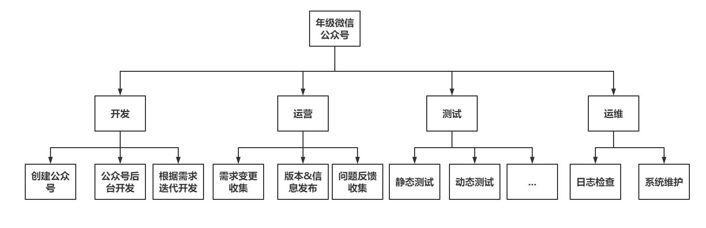
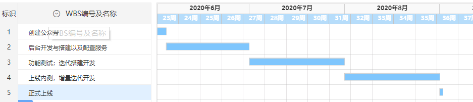
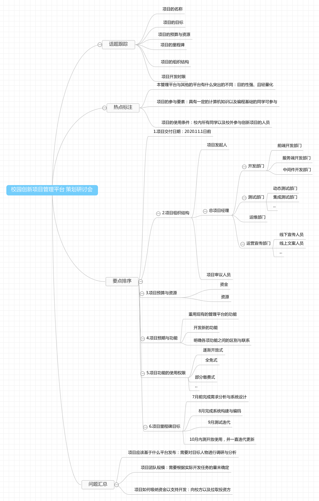

# IT项目管理课程——个人作业四

本文总阅读量次

## 前言

本次作业是本学期IT项目管理课程的第四次作业。

## i)、内容与要求

  - 内容
  
    - 分析与工具（请三选二）
        
        - 1.你联合同学做一个年级微信公众号加强各班相互了解、联合活动等。请编制项目章程和项目管理计划，指导该项目实施与运营。必须包含 **WBS** 和 **甘特图**；

        - 2.请根据教材 HYM 公司案例（教材第四章 Running Case），选择并完成其中一个任务；

        - 3.召开一个项目策划研讨会，每个人用思维导图记录会议内容，该图必须满足“话题跟踪、热点标注、要点排序、问题汇总”四个基本要求。最后，给出这样会议记录的优点与缺点

    - 要求

        - 请在自己博客或 Github 等电子媒体发布自己的作业， 不能使用 doc或 pdf 格式。

        - 作业提交， TA 会通过调查之星等工具收集每次作业 URL 

## ii)、选择

  - 选择 **题1** 和 **题3**

## iii)、题1——你联合同学做一个年级微信公众号加强各班相互了解、联合活动等。请编制项目章程和项目管理计划，指导该项目实施与运营。必须包含 **WBS** 和 **甘特图**；

(一)、项目章程
---
---
**项目名称**：年级微信公众号

**项目开始时间**：2020.06.01

**项目结束时间**：2020.09.01

---
**项目发起人**：xxx

**项目经理**：Win.TD

---
**项目目标**：在3个月内(即下学期开学前)，成功搭建一个年级微信公众号以加强各班相互了解、联合活动等。

**项目成功标准**：公众号能在目标时间范围内搭建成功并交付；项目完成各项功能，且各项功能与功能设计说明高度一致；项目成果经过各项测试且通过；项目成功上线。

---
**总体里程碑进度计划**：

  2020年6月，完成微信公众号设计与搭建以及后台相关数据逻辑处理的初版。
  
  2020年7月，对公众号的功能进行测试，并进行迭代搭建开发。
  
  2020年8月，邀请部分同学进行内测，并根据这些同学反馈的功能问题以及需求问题进一步进行增量迭代开发。

---
**资源预算**：

  - 项目预算为5000元。主要成本分布于开发团队的雇用费用以及租赁服务器及相关开发工具的费用。

  - 项目资源为多台现代终端设备。

---
**整体项目风险**：

  - 因使用人数过多产生的服务器资源不足的情况，可能导致发生预算不足的情况。

  - 测试参与人数过少，不能全面有效获取公众号的不足以及普遍的最新需求。

---
关键相关方名单

| 相关方 | 角色 | 参与任务 | 
|:------:|:------:|:------:|
|XXX|项目发起人|发起项目|
|Win.TD|项目经理|通常项目|
|AAA|开发工程师|搭建公众号|
|BBB|开发工程师|搭建公众号服务器|
|CCC|测试工程师|对公众号功能进行测试|
|DDD|需求分析师|收集各阶段的需求及变化|
|EEE|运营师|各项内容的运营发布工作|
|FFF|运维工程师|日常运维|

---

(二)、项目管理计划

**项目**：年级微信公众号

**项目概述和范围**：本项目是用于加强各班相互了解、联合活动等的微信公众号项目，最终的产品就是可以在各授权微信用户的微信上可使用的微信公众号服务。项目开发总人数7人。

**项目目标**：在3个月内(即下学期开学前)，成功搭建一个年级微信公众号以加强各班相互了解、联合活动等。

**项目的可交付成果**：
  
  - 最终的可运行在微信公众号上的服务

  - 各中间过程的需求，设计和源代码文档

**项目预算概要**：项目预算为5000元以及多台现代终端设备。

**项目假设**：

  - 各阶段需要的人力资源都能够按时到位

  - 项目在7月前能够完成第一版的搭建

**项目约束**：

  - 项目要在2020.09.01按时发布

  - 项目必须遵循产品研发和项目管理规程

**项目计划编制过程**：
  
  - 确定项目生命周期模型的选择

  - 确定项目的方法工具和技术

  - 确定项目范围

  - 制定风险管理计划从而识别识别项目风险

  - 使用WBS对工作进行详细分割

  - 制定项目的进度，确定里程碑

  - 确定项目的人员沟通与进度质量跟踪

  - 确定质量保证以及测试要素

---
**项目组织**：

  - 外部接口：使用的同学以及年级领导

  - 内部结构：强矩阵型组织

  - 角色与职责：

    | 相关方 | 角色 | 参与任务 | 
    |:------:|:------:|:------:|
    |XXX|项目发起人|发起项目|
    |Win.TD|项目经理|通常项目|
    |AAA|开发工程师|搭建公众号|
    |BBB|开发工程师|搭建公众号服务器|
    |CCC|测试工程师|对公众号功能进行测试|
    |DDD|需求分析师|收集各阶段的需求及变化|
    |EEE|运营师|各项内容的运营发布工作|
    |FFF|运维工程师|日常运维|

---
**WBS**：

---
**甘特图**：

## iv)、题3——召开一个项目策划研讨会，每个人用思维导图记录会议内容，该图必须满足“话题跟踪、热点标注、要点排序、问题汇总”四个基本要求。最后，给出这样会议记录的优点与缺点

  - 如图

    

  - 优点：

    - 帮助我们梳理思路；即有利于我们对整体过程的思路理清，为项目开发奠定基础。

    - 帮助我们抓住要点、关键和本质；即有利于我们直接切入整个开发流程的主要目标。

    - 帮助我们发散思考；即有利于我们在既有基础上拓展出更多的要素。

    - 帮助我们进行深层次系统思考；

    - 以图式思考的方式更为直观有力。

  - 缺点：

    - 然而思维导图的方式不利于我们对一些具体问题中的复杂内容进行总结或改进。

    - 思维导图通常风格各异，因此需要PDF或图片等固定化的格式进行存储，非线上传输则不利于编辑，线上传输则容易陷入思维导图的操作约束。

    - 思维导图通常是要点式的，不能像甘特图那样具有形象的时间流展示，因此在此方面有欠缺。

## v)、总结

  - 本次作业是该课程的第四次作业，是理解分析与应用**项目集成管理**相关知识的一次作业(主要集中于项目启动与指定项目计划部分)。
