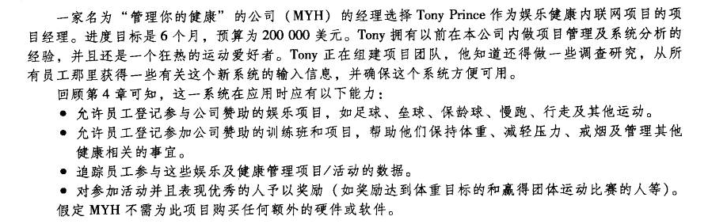
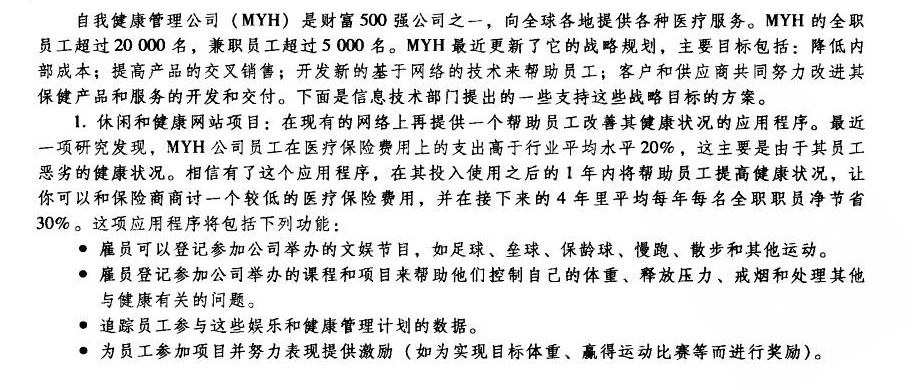
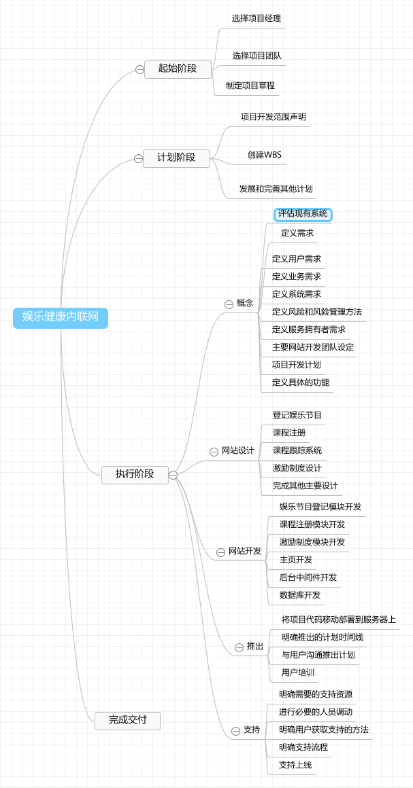
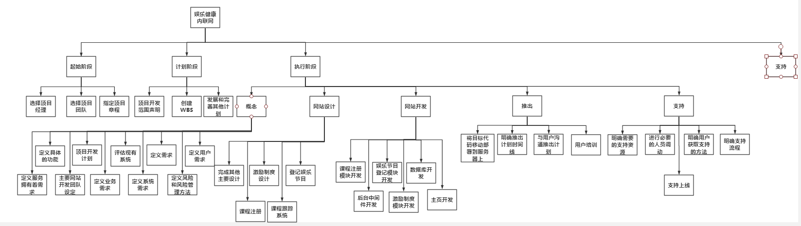

# IT项目管理课程——个人作业五

本文总阅读量次

## 前言

本次作业是本学期IT项目管理课程的第五次作业。

## i)、内容与要求

  - 内容

    - 收集需求与定义范围（请三选二）

      - 1.你联合同学做一个年级微信公众号加强各班相互了解、联合活动等。请写一份两页的报告，描述收集需求的方法，并附上收集的需求跟踪矩阵（不少于五个需求）；

      - 2.使用教材中的微型案例（Running Case），请写一份两页的报告，描述收集需求的方法，并附上收集的需求跟踪矩阵（不少于五个需求）；

      - 3.使用思维导图，为作业1或2构建WBS，并使用项目管理工具制作WBS或根特图。并按要求检查工作包的可管理性，分解完整性。例如：检查测试、培训等。

    - 要求

        - 请在自己博客或 Github 等电子媒体发布自己的作业， 不能使用 doc或 pdf 格式。

        - 作业提交， TA 会通过调查之星等工具收集每次作业 URL 

## ii)、选择

  - 选择 **题2** 和 **题3**

## iii)、题2——使用教材中的微型案例（Running Case ），请写一份两页的报告，描述收集需求的方法，并附上收集的需求跟踪矩阵（不少于五个需求）；

写在前面案例

第4章的描述：

  - **1.高层次需求——由项目章程指出**

    - 在拥有此应用程序后，在其投入使用之后的1年内帮助员工提高健康状况，使公司可以和保险商商讨一个较低的医疗保险费用，并在接下来的4年里平均每年每名全职职员净节省30%。

    - 项目进度目标为6个月，预算为200000美元。

  - **2.收集需求的方法——数据收集——“头脑风暴”集体会议**

    该会议可邀请该项目涉及的各个领域的重要参与者开展，各参与者代表自己所在领域并能为项目或产品需求提供开放性的观点。
    
    通过“头脑风暴”与会者可以敞开思想，使各种设想在相互碰撞中激起脑海的创造性风暴。

    - 确定议题

      一个好的头脑风暴法从对问题的准确阐明开始。因此，必须在会前确定一个目标，使与会者明确通过这次会议需要解决什么问题，同时不要限制可能的解决方案的范围。

    - 会前准备

      为使“头脑风暴”会议效率更高，与会者在会前需要做一点准备工作。如收集自己相关领域的一些资料，简明扼要地在会上提供给所有与会者跟他们简要讲清楚利弊等。

    - 确定人选

      与会者人数太少不利于交流信息，激发思维;人数太多则不容易掌握会议进程，并且每个人发言的机会相对减少，也会影响会场气氛。

      此处确定部分与会者名单：

        - 公司CEO

        - 项目经理Tony Prince

        - 项目IT技术人员

        - 项目健康研究技术人员
        
        - 项目财务人员

        - 项目法律顾问人员

        - 项目宣传组织人员

        - 其他人员

    - 初步得出需求：
      
      - 数据需求：项目需要的数据及格式，并标注好哪些已有或能获取，哪些暂未拥有；如员工参与这些娱乐及健康管理项目/活动的数据等。

      - 业务功能需求：可登记参与公司赞助的娱乐项目

      - 业务功能需求：可允许员工登记参加公司赞助的训练班和项目

      - 业务功能需求：追踪员工参与这些娱乐及健康管理项目/活动的数据

      - 业务功能需求：能够记录并对参与活动并获奖的人员予以奖励

      - 业务需求：不应购买新的软件或硬件

      - 外部接口需求：员工资料系统与项目系统对接接口、公司财务与项目系统对接接口、公司各项目与项目组对接接口、公司法务宣传等于项目组对接接口等。

      - 性能需求：响应时间可控、故障运行时间可接受范围、其他特殊操作对性能的要求。

  - **3.收集需求的方法——数据收集——焦点小组讨论**

    在一名专业主持人的引导下对某个主题或概念进行深入的讨论。

    - 好处：

      - 协同增效：将一组人放在一起讨论，与单个人去询问得到的私人的保密的回答相比，前者可以产生更广泛的信息、深入的理解和看法。

      - 速度快：由于同一时间内同时访问了多个被调查者，因此数据收集和分析过程都是相对比较快的。

    - 以IT部门为例，得到部分需求为：项目组需要一名全职的软件设计架构师、全职的前后端研发团队、专业的数据库DBA、有经验的运维团队等。

    - 以法律顾问部门为例：项目组需要能与公司各个项目进行法务交洽的团队等。

  - **4.收集需求的方法——数据收集——访谈**

    访谈是一种从与某个人或者某个团队进行正式或非正式的交谈（询问有关问题并记录反馈）中获取信息的系统化方法。

    - 两种基本类型

      - 结构化的访谈：访谈者在根据访谈目的在访谈之前设计了一套问题

      - 非结构化的访谈：没有设计问题，通过开放问题方式对业务期望和目标系统展开讨论

    - 以对健康顾问的访谈为例：

      - 问：老师您好，请问对于一些身体健康状况处于亚健康或不健康的职员而言，什么类型的运动以及如何规划能够在一年内有效提高他们的身体素质？

      - 答：这个问题问得好，这个问题可以从x个方面考虑。第一，可以...

    - 得出需求：各种不同运动科学安排等。

  - **5.搜集需求的方法——数据收集——问卷调查**

    调查问卷是一种结构化的调查，其调查问题的表达形式、提问的顺序、答案的方式与方法都是固定的，而且是一种文字交流方式，因此，任何个人，无论是研究者，还是调查员都不可能把主观偏见代入调查研究之中。其调查的统计结果一般都能被量化出来。(**五点量表的方法**)

    - 可以在设计出一定假象功能的情况下对将来要使用该系统的员工进行问卷调查。

    - 也可以在初步问卷调查后通过对数据整合然后访谈专家进行筛选与补充然后再次进行问卷调查。

    - 得出需求：需要对新增加或已注销的娱乐项目和训练班等及时通知、需要对员工具体参与数据进行保密性使用、需要在奖励某员工时公开获奖相关信息等。

  - **6.搜集需求的方法——数据收集——标杆对照**

    此方法因为没有找到类似的系统而没有开展。

  - **7.需求跟踪矩阵**

    基于上面多种不同的需求收集方法得到的结果，建立需求跟踪矩阵(**参考书本P105的表5-1 需求跟踪矩阵样本**)

    | 标识 | 名称 | 种类 | 需求源 | 状态 | 
    |:------:|:------:|:------:|:------:|:------:|
    |R01|在拥有此应用程序后，在其投入使用之后的1年内帮助员工提高健康状况，使公司可以和保险商商讨一个较低的医疗保险费用，并在接下来的4年里平均每年每名全职职员净节省30%|主体需求|项目章程定义|进行中，处于需求分析阶段|
    |R02|项目进度目标为6个月，预算为200000美元。|主体需求|项目章程定义|进行中，处于需求分析阶段(第一个月)|
    |R03|项目需要的数据及格式，并标注好哪些已有或能获取，哪些暂未拥有|数据流|“头脑风暴”集体会议|已完成，已初步定义好|
    |R04|可登记参与公司赞助的娱乐项目|业务功能需求|“头脑风暴”集体会议|进行中，处于需求分析阶段|
    |R05|可允许员工登记参加公司赞助的训练班和项目|业务功能需求|“头脑风暴”集体会议|进行中，处于需求分析阶段|
    |R06|追踪员工参与这些娱乐及健康管理项目/活动的数据|业务功能需求|“头脑风暴”集体会议|进行中，处于需求分析阶段|
    |R07|能够记录并对参与活动并获奖的人员予以奖励|业务功能需求|“头脑风暴”集体会议|进行中，处于需求分析阶段|
    |R08|不应购买新的软件或硬件|业务需求|“头脑风暴”集体会议|进行中，处于需求分析阶段|
    |R09|员工资料系统与项目系统对接接口|软件|“头脑风暴”集体会议|进行中，处于需求分析阶段|
    |R10|公司财务与项目系统对接接口|软件|“头脑风暴”集体会议|进行中，处于需求分析阶段|
    |R11|公司各项目与项目组对接接口|软件|“头脑风暴”集体会议|进行中，处于需求分析阶段|
    |R12|公司法务宣传等于项目组对接接口|软件|“头脑风暴”集体会议|进行中，处于需求分析阶段|
    |R13|响应时间可控|性能需求|“头脑风暴”集体会议|进行中，处于需求分析阶段|
    |R14|故障运行时间可接受范围|性能需求|“头脑风暴”集体会议|进行中，处于需求分析阶段|
    |R15|其他特殊操作对性能的要求|性能需求|“头脑风暴”集体会议|进行中，处于需求分析阶段|
    |R16|项目组需要一名全职的软件设计架构师、全职的前后端研发团队、专业的数据库DBA、有经验的运维团队|人员|焦点小组讨论|进行中，处于需求分析阶段|
    |R17|项目组需要能与公司各个项目进行法务交洽的团队|人员|焦点小组讨论|进行中，处于需求分析阶段|
    |R18|各种不同运动科学安排|科学理论|访谈|已完成|
    |R19|对新增加或已注销的娱乐项目和训练班等及时通知、需要对员工具体参与数据进行保密性使用、需要在奖励某员工时公开获奖相关信息|软件|问卷调查|进行中，处于需求分析阶段|
    

## iv)、题3——使用思维导图，为作业1或2构建WBS，并使用项目管理工具制作WBS或根特图。并按要求检查工作包的可管理性，分解完整性。例如：检查测试、培训等。

- **思维导图构建WBS**

  

- **使用项目管理工作制作WBS**

  

- **检查工作包的可管理性，分解完整性**

  - 每个任务的状态和完成情况是可以量化的。
    
    - 如执行阶段-->网站开发-->娱乐节目登记模块开发：该项目根据设计开发文档，可以界定开发完成度。

  - 明确定义了每个任务的开始和结束。

    - 如执行阶段-->网站设计-->课程注册：该任务开始于仅有需求文档和相关项目章程文档，结束于设计好课程注册的网站UI以及逻辑处理功能等。

  - 每个任务都有一个可交付成果。

    - 如执行阶段-->概念-->定义需求：可交付一个高层次需求文档。

  - 工期易于估算且在可接受期限内。

    - 所有工作都需要在6个月内完成

  - 容易估算成本。

    - 所有工作资金消耗总和不超过200000美元。

  - 各项任务是独立的。

    - 如执行阶段-->概念中的各项任务：各项任务都进行不同的分析，不仅针对不同的个体开展，而且交付的可交付成果也都是不同的。

  

## v)、总结

  - 本次作业是该课程的第五次作业，是理解分析与应用**项目范围管理与软件需求控制**相关知识的一次作业，在此次作业中我成功实践了对于需求的收集与整理分析，同时也基于思维导图对示例项目进行了构建WBS分析。
