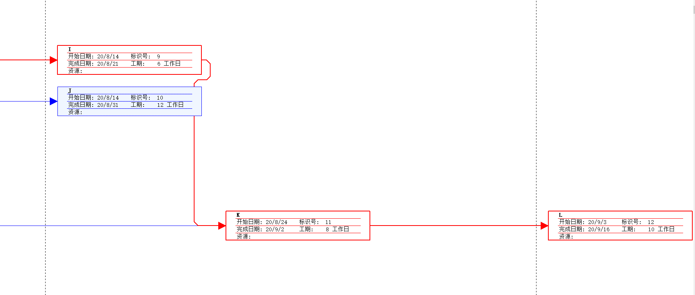

# IT项目管理课程——个人作业六

本文总阅读量次

## 前言

本次作业是本学期IT项目管理课程的第六次作业。

## i)、内容与要求

  - 内容

    - 练习

      - 1.教材练习题6；

      - 2.教材练习题7；

      - 3.收集网上资料，总结看板在软件项目中的使用（约2-3页）。

    - 要求

        - 不能使用 doc或 pdf 格式。

        - 作业提交， TA 会通过调查之星等工具收集每次作业 URL 

## ii)、题1——教材练习题6；

  - 题目(截的是中文版)：

    

  - a.画出该项目的双代号网络图，把节点的号码标在一个圆圈内，画出节点之间的箭线 ，在每一条箭线上标注代表活动的字母和活动工期。

    

  - 按照图6-8表示每条路径的方法，找出网络图中的所有路径并标出它们的长度
  
      - 此处不再贴出示例，直接解答

      - 路径1：A-B-E-H-K      长度 = 2+2+2+2+2 = 10天

      - 路径2：A-B-E-I-J-K    长度 = 2+2+2+5+1+2 = 14天

      - 路径3：A-C-F-H-K      长度 = 2+3+3+2+2 = 12天

      - 路径4：A-C-F-I-J-K    长度 = 2+3+3+5+1+2 = 16天

      - 路径5：A-D-G-J-K      长度 = 2+4+6+1+2 = 15天

  - 哪条是该项目的关键路径？它的长度是多少？

      - 关键路径：A-C-F-I-J-K，长度为16天。

  - 完成该项目所需的最短时间是多少？

      - 16天

## iii)、题2——教材练习题7；

- 题目

  

  而练习4为：

  

- 解答：

  - 甘特图：

    

  - 网络图：

    

    

    

  - 任务进度表：

    

  - 关键路径(如何从图中看出下面对网络图的解释有叙述)：

    A-D-F-G-I-K-L

  - 每项活动的浮动时间或时差

    

    上图已经列得非常详细了

    所谓浮动时间指的有总浮动时间和自由浮动时间，其中：

    总浮动时间是指在不延误项目完成日期或违反进度制约因素的前提下，某进度活动可以推迟的总时间量(从其最早开始日期起算)。

      - 总浮动时间 = 最晚开始时间-最早开始时间 = 最晚完成时间-最早完成时间

      - 浮动时间（FLOAT）= 时差（SLACK）= 总浮动时间（TOTAL FLOAT）= 路径浮动时间（Path FLOAT）

    自由浮动时间是指可以在不推迟任何后续活动的最早开始时间的情况下本活动可以推迟的时间。

      - 自由浮动时间 = (后续活动的最早开始时间) - (本活动的最早完成时间)

      - 自由浮动时间（FREE FLOAT）= 活动浮动时间（ACTIVITY FLOAT）

    **PS：上图中各项任务的可宽延的总时间就是各项任务的浮动时间或时差。**

- 解释：
  
  - 甘特图：

    - 甘特图（Gantt chart）又称为横道图、条状图(Bar chart)。其通过条状图来显示项目，进度，和其他时间相关的系统进展的内在关系随着时间进展的情况。以提出者亨利·劳伦斯·甘特（Henry Laurence Gantt）先生的名字命名。

    - 具体名称的意思简明易懂——详细解释可看下方任务进度表中相关字段解释，基本一致。

  - 网络图：

    - 网络图(Network planning)是一种图解模型，形状如同网络，故称为网络图。网络图是由作业（箭线）、事件（又称节点）和路线三个因素组成的。
    
    - 在软件工程管理中，经常使用到网络图的概念。网络图是用箭线和节点将某项工作的流程表示出来的图形。

    - 而在本例中节点(事件)是由开始时间、完成时间、标识号、工期和所需资源组成。

    - 其中红色线表示关键路径(即工期最长的路径)

  - 任务进度表：

    - 标识号：表格中的序列号，与项目无直接关系(主要出现在网络图中)

    - 任务名称：该列表示任务的名称

    - 工期：该列的内容表示对应任务完成需要的工期

    - 开始时间：该列内容对应各任务开始的时间

    - 完成时间：该列内容对应各任务完成的时间

    - 前置任务：该列内容表示各任务开始需要的前置完成任务，即前置任务完成后本任务才能开始，若无则置空。

    此外还可以通过调用Project2007中的一些方法来获取任务进度表更多的形式，如：

    - 日程：

      

    - 跟踪：

      

    等等。

  

## iv)、题3——收集网上资料，总结看板在软件项目中的使用（约2-3页）。

> “看板”是一种生产管理系统，由1940年代的丰田汽车公司发明。名称源自日文“看板”。在软件开发过程，可以使用用“看板卡”（经常为即时贴）来执行看板。这些卡片不是作为提高生产量的信号，而是用于记载生产数量和标记生产过程。在虚拟看板系统中，会使用虚拟看板卡。在软件开发中,我们采用虚拟看板系统来限制在制品。 ——维基百科

> 看板管理，常作“Kanban管理”（来自日语“看板／カンバン Kanban”），是丰田生产模式中的重要概念，指为了达到及时生产（JIT）方式控制现场生产流程的工具。及时生产方式中的拉式生产系统可以使信息的流程缩短，并配合定量、固定装货容器等方式，而使生产过程中的物料流动顺畅。——维基百科

> 看板管理亦称“看板方式”、“视板管理”。在工业企业的工序管理中，以卡片为凭证，定时定点交货的管理制度。“看板”是一种类似通知单的卡片，主 要传递零部件名称、生产量、生产时间、生产方法、运送量、运送时间、运送目的地、存放地点、运送工具和容器等方面的信息、指令。一般分为：在制品看板，它用于固定的相邻车间或生产线；信号看板，主要用于固定的车间或生产线内部；订货看板 (亦称“外协看板”)，主要用于固定的协作厂之间。——百度百科

- 看板方法原则：

  - 从你现在执行的任务开始
  
    看板方法从你目前执行的任务和过程开始,针对你的系统作出持续性、增量、渐进式的改变。

  - 同意追求渐进式进化

    组织(或团队)必须同意持续、渐进式进化是一种改进系统并让系统顺畅的方法。执行彻底的改变可能更具效率,但因组织的阻力和恐惧,而存在着更高的失败率。看板方法针对你目前的系统,促进微小的增量与渐进式变化。

  - 遵守当前流程、任务、职责、职位

    同意尊重当前任务、职责、职位,则能消除前期恐惧,进而促进未来的变化,并使看板计划获得更广泛的支持。

  - 各级领导

    在组织中,从个人贡献者到高级管理层的各级领导的行为应当受到激励。

- **看板方法与软件项目流程管理**——摘自此[博客](https://www.baidu.com/link?url=GAhmBnrb091DC9DrEWhlBjPWwmn-4jHYmMCfxZSJtMaEKopNyvfCCuNhN17K3xBMJDi7K8aCIyPjHc7HK9goTeDqE-eV_UTrhHPEAkweMmO&wd=&eqid=b2d555a80004f00e000000065f0adddc)

  - 一个日常开发过程中的典型场景，一个迭代的开发过程由产品提出需求、需求分析、开发、测试、产品验收和发布等几个步骤组成，下图是一个正常的看板任务分配。
  
  

  - 如果某一段时间测试人员生病请假，显而易见，看板上在测试这一栏中很快就会堆积很多需要测试的开发任务，如下图

  

  - 有了团队工作流程的一个更加准确的**可视化结果**，就很容易就发现团队的瓶颈所在。团队中已经有人清楚问题的关键，接可以做开发流程上的改进——**在制品**——当前某个环节中正在开发的任务，而限制在制品就是为这个开发任务数量设定一个上限，即限制在制品就是要管理管道中的负载。

  - 当测试工作出现瓶颈，可以给某个环节的在制品设置一个上限意味着限制了可以进入该步骤的任务的数量。这样可以帮助限制团队的选项，从而让团队的选择变得更容易。针对上述例子中的这个测试环节，可以把测试在制品上限设为五，当第六个开发任务即将进入测试环境时，我们就会发现它已经超过了这个环节的在制品上限。

    PS：添加一栏“被测试推迟”的任务，就可以将这个问题**充分暴露出来**。同时需要停下来考虑一下如何解决测试资源不足的问题——从其他团队调用一个测试人员过来做短期支援，或鼓励全民测试，或其它方法。
  
  

- **看板管理与软件项目维护管理**——参考论文：[看板管理在软件维护项目中的应用Board Management Application in Software Maintenance Projects](http://www.wanfangdata.com.cn/details/detail.do?_type=perio&id=jsjgprjyyy201119035)

  - 看板在软件维护项目中的具体应用过程如下：

    一：在工作区距离所有项目组成员最近的地方放置一块白板。

    二：项目组对项目的工作流程达成共识，并将整个工作流程分解为若干个步骤，在白板上划分出相应的列。

    三：项目经理将待办工作按优先级别分类，再把每项工作分解成大小较合适的可执行单元，例如：每个最小和执行单元为1人/天工作量，然后制成卡片。卡片是纸制的，可以是便笺纸，也可以是剪裁合适尺寸的纸，尽量不要太大。粘贴在待办工作栏。

    四：项目组成员主动领取任务，并将每个任务一步步推进，当一个步骤完成后，就把任务卡从一个栏目转移到下一个栏目，直至完成。

    五：每一个工作周期后(例如一个星期)，项目经理把完成的卡片从看板上取下归档，用于以后查阅。

  - 由于该文章发表时间距今已有9年，当今还可以将主干内容提到线上以保证更好的利用率与保存率。

- **实体白板/黑板**：源自[简书博客](https://www.jianshu.com/p/24e8229adc62?utm_campaign=maleskine&utm_content=note&utm_medium=seo_notes&utm_source=recommendation)

  - 白板、列表、便签纸、图钉、磁铁等。

- **互联网式看板**：源自[简书博客](https://www.jianshu.com/p/24e8229adc62?utm_campaign=maleskine&utm_content=note&utm_medium=seo_notes&utm_source=recommendation)

  - Trello：网页端&移动端，https://trello.com/

  - WeKan：https://wekan.io/

  - eangoo：国内，https://www.leangoo.com/

- **软件项目管理在看板中的职责分类**：源自[简书博客](https://www.jianshu.com/p/24e8229adc62?utm_campaign=maleskine&utm_content=note&utm_medium=seo_notes&utm_source=recommendation)

  - **项目管理主导型**：即对每个成员进行**需要做**、**正在做**以及**做完**的任务记录。

  - **成员主导型**：将任务拆成多个小任务，供成员“抢选”

  - **原文中还有一段非常精炼**：
    
    - 如果你是一个后端的开发主管，那你的手下肯定都是后端，则列表项就是最基本的Todo、Doing、Done三列

    - 如果你是一个技术部的老大，你管理者程序员、测试、运维，那你的列表项可以是Todo、Dev-Doing、Dev-Done、Testing、Deploy五列

    - 如果你是一个产品制作人/产品经理，你的团队成员包含了一个产品创建所需要的所有人员，那你可能需要2个看板，一个是需求池看板，一个是迭代流程的看板。

## v)、总结

  - 本次作业是该课程的第六次作业，是理解分析与应用**项目时间管理**相关知识的一次作业，在此次作业中我成功实践了对于活动定义与安排中的双代号网络图(AOA、箭线图)的应用，同时也使用Microsoft Project生成了甘特图、网络图和任务进度表，最后还对看板在软件项目中的应用进行了网络信息检索总结。
