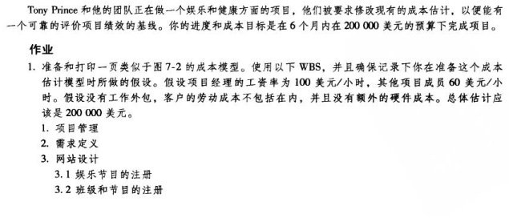
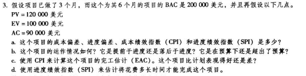
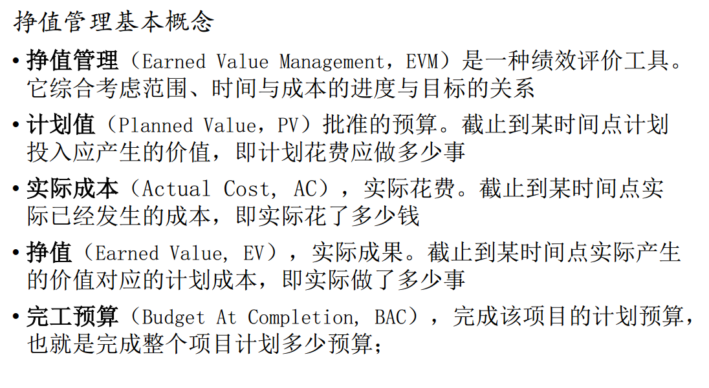
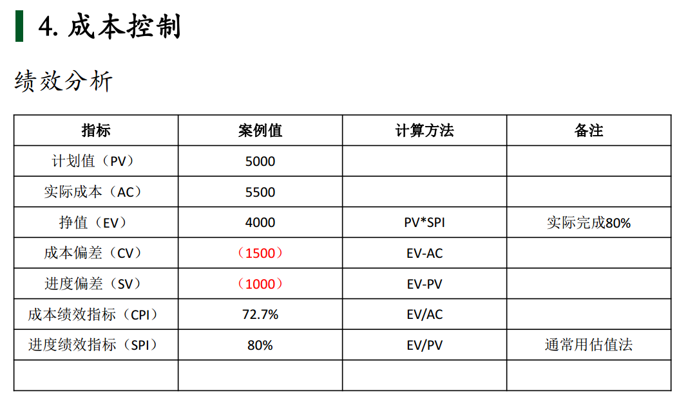

# IT项目管理课程——个人作业七

本文总阅读量次

## 前言

本次作业是本学期IT项目管理课程的第七次作业。

## i)、内容与要求

  - 内容

    - 练习

      - 1.完成作业1~3的要求，使用 project 或其他项目管理工具

    - 要求

        - 不能使用 doc或 pdf 格式。

        - 作业提交， TA 会通过调查之星等工具收集每次作业 URL 

## ii)、题1——操作案例练习1；

  - 题目(截的是中文版)：

    

    

  - **图7-2略，可参考《Managing Information Technology Projects(6 edit)》的162页**

  - 如下图表：

    | WBS条目 | 数量或小时数 | 单位小时成本(美元) | 子层总和(美元) | WBS第2层总和(美元) | 占总和的% |
    |:------|:------:|:------:|:------:|:------:|:------:|
    |**1.项目管理**||||**44 000**|22%|
    |&emsp;项目经理|350|100|35 000|||
    |&emsp;项目团队成员|150|60|9 000|||
    |**2.需求定义**|150|60|9 000|9 000|4.5%|
    |**3.网站设计**||||30 000|15%|
    |&emsp;3.1 娱乐节目的注册|150|60|9 000|||
    |&emsp;3.2 班级和节目的注册|150|60|9 000|||
    |&emsp;3.3 跟踪奖励|100|60|6 000|||
    |&emsp;3.4 奖励系统|100|60|6 000|||
    |**4.网站开发**||||72 000|36%|
    |&emsp;4.1 娱乐节目的注册|300|60|18 000|||
    |&emsp;4.2 班级和节目的注册|300|60|18 000|||
    |&emsp;4.3 跟踪奖励|300|60|18 000|||
    |&emsp;4.4 奖励系统|300|60|18 000|||
    |**5.测试**|200|60|12 000|12 000|6%|
    |**6.测试、运行和支持**|550|60|33 000|33 000|16.5%|
    |**总项目成本估计**||||200 000||
 

## iii)、题2——操作案例练习2；

  - 题目(截的是中文版)：

    

  - 解答：

    项目进度和成本目标是6个月和200 000美元，成本基线图(表)如下：

    | WBS条目 | 1 | 2 | 3 | 4 | 5 | 6 | 总和 |
    |:------|:------:|:------:|:------:|:------:|:------:|:------:|:------:|
    |**1.项目管理**||||||||
    |&emsp;项目经理|$5 833|$5 833|$5 833|$5 833|$5 833|$5 833|$35 000|
    |&emsp;项目团队成员|$1 500|$1 500|$1 500|$1 500|$1 500|$1 500|$9 000|
    |**2.需求定义**|$7 200|$1 800|||||$9 000|
    |**3.网站设计**||||||||
    |&emsp;3.1 娱乐节目的注册||$6 000|$3 000||||$9 000|
    |&emsp;3.2 班级和节目的注册||$6 000|$3 000||||$9 000|
    |&emsp;3.3 跟踪奖励|||$4 000|$2 000|||$6 000|
    |&emsp;3.4 奖励系统|||$4 000|$2 000|||$6 000|
    |**4.网站开发**||||||||
    |&emsp;4.1 娱乐节目的注册|||$6 000|$12 000|||$18 000|
    |&emsp;4.2 班级和节目的注册|||$6 000|$12 000|||$18 000|
    |&emsp;4.3 跟踪奖励||||$6 000|$12 000||$18 000|
    |&emsp;4.4 奖励系统||||$6 000|$12 000||$18 000|
    |**5.测试**|$1 000|$1 000|$3 000|$3 000|$4 000||$12 000|
    |**6.测试、运行和支持**||||||$33 000|$33 000|
    |**总项目成本估计**|$15 533|$22 133|$36 333|$50 333|$35 333|$40 333|$200 000|

## iv)、题3——操作案例练习3。

  - 题目(截的是中文版)：
    
    

  - 相关知识点——截自PPT：

    

    

  - a.
    
    - 项目偏差：EV - AC = $100 000 - $90 000 = $10 000

    - 进度偏差：EV - PV = $100 000 - $120 000 = -$20 000

    - 成本绩效指数(CPI)：EV/AC = $100 000 / $90 000 = 111%

    - 进度绩效指数(SPI)：EV/PV = $100 000 / $120 000 = 83%

  - b.
    
    - 运作情况中规中矩，落后于进度，但在预算内。

  - c.

    - EAC = BAC/CPI = $200 000/1.11 = $180 180

    - 使用CPI来计算这个项目的完工估计(EAC)，该项目最新的预测完工需要资金小于$200 000，因此变现得更好。

  - d.

    - 估计花费时长(完成项目)：6 months / 0.83 = 7.229 months

    - 即估计花费7.229个月，比预计的要长

## v)、总结

  - 本次作业是该课程的第七次作业，是理解分析与应用**项目成本管理**相关知识的一次作业，在此次作业中我成功实践了对于项目成本估计、成本基线以及成本控制相关变量计算的应用，收获颇丰。
