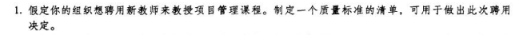
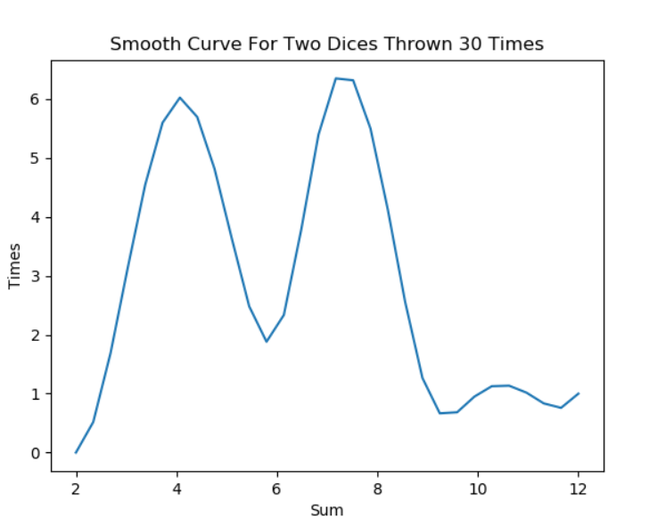

# IT项目管理课程——个人作业八

本文总阅读量次

## 前言

本次作业是本学期IT项目管理课程的第八次作业。

## i)、内容与要求

  - 内容

    - 练习(二选一)：

      - 1.教材练习题作业1~3

      - 2.教材操作案例（Running Case）作业1-3

    - 要求

        - 不能使用 doc或 pdf 格式。

        - 作业提交， TA 会通过调查之星等工具收集每次作业 URL 

## 说明：选择任务1：教材练习题作业1~3

## ii)、题1——教材练习题作业1；

  - 题目(截的是中文版)：

    

  - 质量标准清单：

    - 管理学硕士及以上学历

    - 世界500强企业的项目经理曾任或现任

    - 从事项目管理工作年限需10年以上

    - 保证能完整到校教学21周，且每周有充分时间进行课下答疑

    - 保证在学期内带领学生完成一个成规模的项目

    - 能为学生近期实习就业提供指导意见

## iii)、题2——教材练习题作业2；

  - 题目(截的是中文版)：

    

  - 解答：
    

  - [文件链接](./problem2.xlsx)
    

## iv)、题3——教材练习题作业3。

  - 题目(截的是中文版)：
    
    

  - 使用python，详见[代码](./dice.py)(可修改投掷次数)，下面是投掷30次的时候

    - 柱状图

    

    - 圆滑曲线

    

  - 事实上，即使投掷了300000次或更多，根据概率论的计算与实际模拟，得出其骰子的概率分布如下：

    - P(Y=2): 1/36

    - P(Y=3): 1/18

    - P(Y=4): 1/12

    - P(Y=5): 1/9

    - P(Y=6): 5/36

    - P(Y=7): 1/6

    - P(Y=8): 5/36

    - P(Y=9): 1/9

    - P(Y=10): 1/12
    
    - P(Y=11): 1/18

    - P(Y=12): 1/36

  - 因此，它并不符合正态分布

  - 但是，参考这篇[文章](https://www.lfhacks.com/t/dice-normal)，里面有说明与演算：

    

    
## v)、总结

  - 本次作业是该课程的第八次作业，是理解分析与应用**项目质量管理**相关知识的一次作业，收获颇丰。
